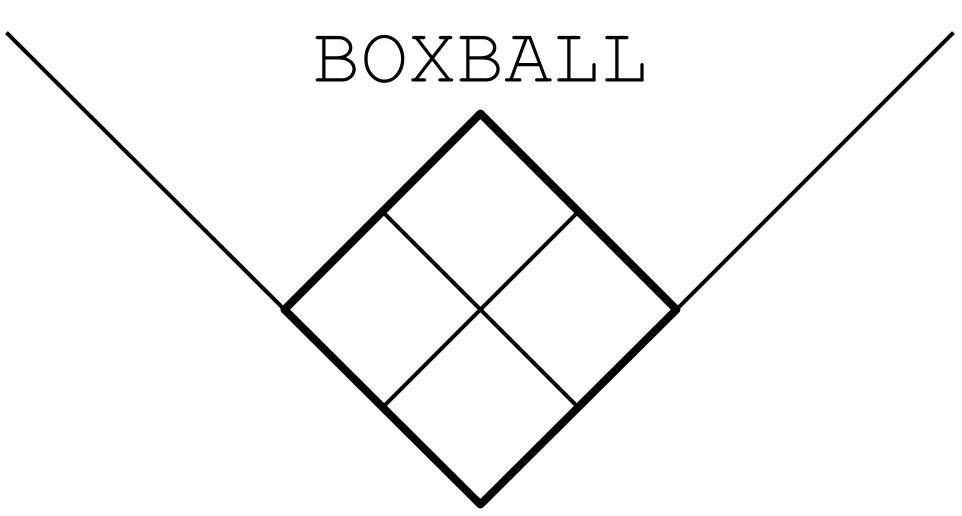

<p align="center">

</p>
<p align="center">

<a href="https://github.com/droher/boxball/actions/workflows/ci.yml">
    
</a>
<a href="https://www.codacy.com?utm_source=github.com&amp;utm_medium=referral&amp;utm_content=droher/boxball&amp;utm_campaign=Badge_Grade">
    
</a>
<a href="https://www.codacy.com?utm_source=github.com&amp;utm_medium=referral&amp;utm_content=droher/boxball&amp;utm_campaign=Badge_Coverage">
    
</a>

<a href="https://opensource.org/licenses/Apache-2.0">
    </a>
<br>
</p>

**Update**: I have released a new project, [baseball.computer](https://baseball.computer), which is designed
as the successor to boxball. It is much easier to use (no Docker required, runs entirely in your browser/program)
and includes many more tables, features, and quality controls. The event schema is different, which will be the main migration pain point. _I aim to continue Boxball maintenence and updates as long as people are still using it,_ and I may try to rebase
boxball on top of the new project to make maintaining both easier. Please let me know if there are things you can do in Boxball that you can't do yet in baseball.computer by filing an issue on the [repo](https://github.com/droher/baseball.computer) or reaching me at david.roher@baseball.computer. 

## Introduction
**Boxball** creates prepopulated databases of the two most significant open source baseball datasets:
[Retrosheet](http://retrosheet.org) and the [Baseball Databank](https://github.com/chadwickbureau/baseballdatabank).
Retrosheet contains information on every major-league pitch since 2000, every play since 1928,
every box score since 1901, and every game since 1871.
The Databank (based on the [Lahman Database](http://www.seanlahman.com/baseball-archive/statistics/)) contains yearly
summaries for every player and team in history. In addition to the data and databases themselves, Boxball relies on the following tools:
*   [Docker](https://docs.docker.com/engine/docker-overview/) for repeatable builds and easy distribution
*   [SQLAlchemy](https://www.sqlalchemy.org/) for abstracting away DDL differences between databases
*   [Chadwick](https://github.com/chadwickbureau/chadwick) for translating Retrosheet's complex event files into a relational format

Follow the instructions below to install your distribution of choice. The full set of images is also available on
Docker Hub.

The Retrosheet schema is extensively documented in the code; see the source [here](https://github.com/droher/boxball/blob/master/transform/src/schemas/retrosheet.py)
until I find a prettier solution.

If you find the project useful, please consider donating to:
*   The [Ali Forney Center](https://aliforneycenter.donordrive.com/index.cfm?fuseaction=donate.general) for homeless LGBTQ youth
*   [350.org](https://act.350.org/donate/build/), a grassroots international climate change organization

Feel free to [contact me](mailto:david@boxball.io) with questions or comments! 

## Requirements
*   [Docker](https://docs.docker.com/install/) (v18.06, earlier versions may not work)
*   2-20GB Disk space (depends on distribution choice)
*   500MB-8GB RAM available to Docker (depends on distribution choice)

## Distributions
### Column-Oriented Databases
#### Postgres columnar (Recommended)
This distribution uses [Citus](https://github.com/citusdata/citus)' native `USING columnar`
table access method to turn PostgreSQL into a column-oriented database. This means that you get
the rich featureset of Postgres, but with a large improvement in query speed and disk usage on
the wide play-by-play tables. Citus columnar replaces the older `cstore_fdw` extension that this
project used to ship; see [ADR 0001](docs/adr/0001-columnar-pg.md) for the rationale. To install
and run the database server:

`docker run --name postgres-columnar -d -p 5433:5432 -e POSTGRES_PASSWORD="postgres" -v ~/boxball/postgres-columnar:/var/lib/postgresql/data doublewick/boxball:postgres-columnar-latest`

Roughly an hour after the image is downloaded, the data will be fully loaded into the database, and you can connect to it as the user `postgres`
with password `postgres` on port `5433`
(either using the `psql` command line tool or a database client of your choice). The data will be persisted on your machine in
`~/boxball/postgres-columnar` (~1.5GB), which means you can stop/remove the container without having to reload the data
when you turn it back on.

> **Note:** Citus columnar tables are append-only — `UPDATE`, `DELETE`, and foreign keys are
> not supported on them. Use the plain `postgres` target if you need a mutable copy of the data.
>
> **arm64 note:** This image is **amd64-only**. Citus does not publish arm64
> packages, so on arm64 hosts (Apple Silicon, AWS Graviton) the image runs
> under emulation (slow) — or use the plain `postgres` target for native
> arm64.

#### Clickhouse
[Clickhouse](https://clickhouse.yandex/) is a database developed by Yandex with some very impressive performance benchmarks. It uses less
disk space than Postgres columnar, but significantly more RAM (~5GB). I've yet to run any query performance comparisons.
To install and run the database server:

`docker run --name clickhouse -d -p 8123:8123 -v ~/boxball/clickhouse:/var/lib/clickhouse doublewick/boxball:clickhouse-latest`

15-30 minutes after the image is downloaded, the data will be fully loaded into the database, and you can connect to it either by attaching the
container and using the `clickhouse-client` CLI or by using a local database client on port `8123` as the user `default`. 
The data will be persisted on your machine in
`~/boxball/clickhouse` (~700MB), which means you can stop/remove the container without having to reload the data
when you turn it back on.

### Traditional (Row-oriented) Databases
Note: these frameworks are likely to be prohibitively slow when querying play-by-play data, and they take up significantly
more disk space than their columnar counterparts.
#### Postgres
Similar configuration to the columnar version above, but stored in the conventional row-oriented way (and supports `UPDATE`/`DELETE`/foreign keys).

`docker run --name postgres -d -p 5432:5432 -e POSTGRES_PASSWORD="postgres" -v ~/boxball/postgres:/var/lib/postgresql/data doublewick/boxball:postgres-latest`

Roughly 90 minutes after the image is downloaded, the data will be fully loaded into the database,
and you can connect to it as the user `postgres` with password `postgres` on port `5432`
(either using the `psql` command line tool or a database client of your choice). The data will be persisted on your machine in
`~/boxball/postgres` (~12GB), which means you can stop/remove the container without having to reload the data
when you turn it back on.

#### MySQL
To install and run:

`docker run --name mysql -d -p 3306:3306 -v ~/boxball/mysql:/var/lib/mysql doublewick/boxball:mysql-latest`

Roughly two hours after the image is downloaded, the data will be fully loaded into the database,
and you can connect to it as the user `root` on port `3306`. The data will be persisted on your machine in
`~/boxball/mysql` (~12GB), which means you can stop/remove the container without having to reload the data
when you turn it back on.

#### SQLite (with web UI)
To install and run:

`docker run --name sqlite -d -p 8080:8080 -v ~/boxball/sqlite:/db doublewick/boxball:sqlite-latest`

Roughly two minutes after the image is downloaded, the data will be fully loaded into the database. `localhost:8080`
will provide a [web UI](https://github.com/coleifer/sqlite-web) where you can write queries and perform schema exploration.

### Flat File Downloads

#### Parquet
Parquet is a columnar data format originally developed for the Hadoop ecosystem. It has solid support in Spark, Pandas,
and many other frameworks.
[OneDrive](https://1drv.ms/u/s!AtpEocFNRNBWhAqZMaj40Bb8__6u?e=dNJiod)

#### CSV
The original CSVs from the extract step (each CSV file is compressed in the ZSTD format).
[OneDrive](https://1drv.ms/u/s!AtpEocFNRNBWhDLuZqcmXYOIieKQ?e=xP4Azs)

## Development

Host-side dev workflow uses [uv](https://docs.astral.sh/uv/) for environment management:

```
uv sync                      # provision dev env from pyproject.toml + uv.lock
uv run pytest --cov          # tests
uv run ruff check .          # lint
uv run basedpyright          # type check (advisory; baseline-only)
make ci                      # full CI pipeline locally via act
```

### Multi-arch builds

Compose declares `linux/amd64` + `linux/arm64` as the build platforms for every
target except `postgres-columnar`, which is amd64-only because Citus does not
ship arm64 packages on packagecloud (the install script aborts with "the Citus
repository does not contain packages for non-x86_64 architectures"). Use the
plain `postgres` target if you need an arm64 image.

Multi-platform builds need a buildx builder backed by the `docker-container`
driver — the default `docker` driver errors with "Multi-platform build is not
supported for the docker driver". One-time setup:

```
make buildx-bootstrap     # creates a docker-container builder named "boxball"
make compose-build SVC=extract BUILD_ENV=test     # multi-arch via the wrapper
```

The `compose-build` target sets `BUILDX_BUILDER=boxball` for the invocation.
That env var is required because `docker buildx use` is not honoured by
`docker compose build` in compose v2. If you prefer to invoke compose
directly, set the env var yourself:

```
BUILDX_BUILDER=boxball BUILD_ENV=test docker compose build extract
```

CI uses the same env-var mechanism: `docker/setup-buildx-action@v3` provisions
a builder and the build step exports its id as `BUILDX_BUILDER` (see
`.github/workflows/ci.yml`).

Caveat: multi-platform compose builds run inside the buildx daemon and do not
`--load` the resulting manifest list back into the local Docker image store
(only single-platform builds can `--load`). Downstream stages that reference a
parent by tag (`FROM doublewick/boxball:extract-${VERSION}`) therefore resolve
against the registry, not against the just-built local cache. Until the
release pipeline pushes fresh multi-arch tags (PLE-358), end-to-end multi-arch
chains pulling intermediate images from the registry will pull whatever's
published there (currently amd64-only). For host-arch single-platform builds,
drop `BUILDX_BUILDER` and the default driver does the right thing.

### Build-time logging

Pipeline scripts log via stdlib `logging` (configured by `extract/parsers/_logging.py`
and `transform/src/_logging.py`). The `extract`, `parquet`, and `ddl` Dockerfiles default
to `BOXBALL_LOG_LEVEL=INFO` and tag every log line with a stage label
(`BOXBALL_STAGE`). Override the level from the host shell — Compose forwards it as a
build arg:

```
BOXBALL_LOG_LEVEL=DEBUG docker compose build extract
BOXBALL_LOG_LEVEL=WARNING docker compose build parquet ddl
```

## Acknowledgements
Ted Turocy's [Chadwick Bureau](http://chadwick-bureau.com/) developed the tools and repos that made this project possible. I am also grateful to [Sean
Lahman](http://www.seanlahman.com/) for creating his database, which I have been using for over 15 years. I was able
to develop and host this project for free thanks to the generous open-source plans of [Jetbrains](https://www.jetbrains.com/?from=boxball), Github, and Docker Hub.

Retrosheet represents the collective effort of thousands of baseball fans over 150 years of scorekeeping and data entry.
I hope Boxball facilitates more historical research to continue this tradition.

## Licence(s)
All code is released under the Apache 2.0 license. Baseball Databank data is distributed under the [CC-SA 4.0](https://creativecommons.org/licenses/by-sa/4.0/)
license. Retrosheet data is released under the condition that the below text appear prominently:

``` 
The information used here was obtained free of
charge from and is copyrighted by Retrosheet.  Interested
parties may contact Retrosheet at "www.retrosheet.org".
```
